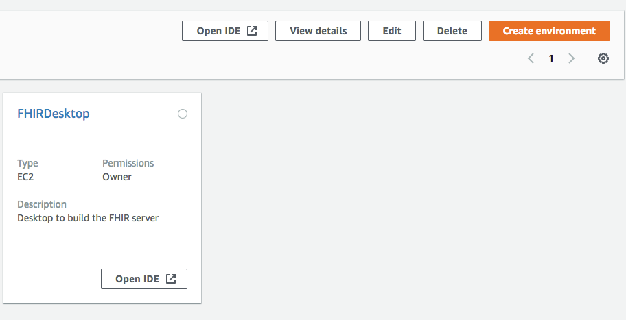
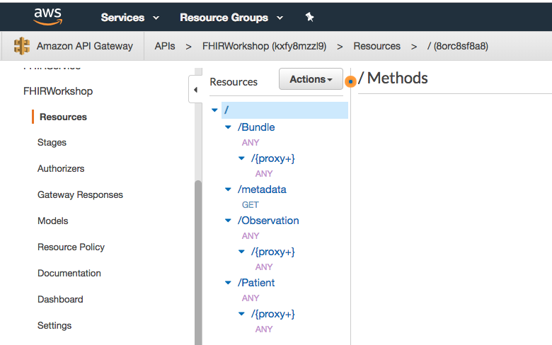

# Reinvent -2019 - HLC 401 - Lab Instructions - Master

**Pre-requisites** :The workshop assumes that the participants have some basic understanding of AWS services such as AWS Lambda, IAM, DynamoDB and the Java programming language.  The account user should have admin access to create IAM roles.

The workshop is divided into two parts. The first part of the workshop focuses on building a FHIR interface. It will be a RESTful endpoint which enables loading and retrieval of FHIR resources. We will deploy CapabilityStatement, Patient, Observation and Condition resources. The second part will show how Amazon Comprehend Medical can be used to extract clinical entities from HL7 V2 and FHIR messages, and load them into FHIR repository created in part 1 of the workshop.

## Lab 1 - Build FHIR Interface


1. Log on to the AWS management console and make sure your region from the top right corner is set to US West(Oregon). 
1. Click on services and search for cloud9. Cloud9 service is a browser based built-in IDE desktop to write code, run CLI commands or create container images. It has a pre-configured AWS CLI and provides a linux terminal to run commands.
1. Create a new environment and call it as FHIRDesktop. **Use m4.large type. Leave the other settings as default.**



## Download source code 

1. Go to the terminal window at the lower pane and checkout the source code from git hub using the following command:

    ```
    git clone https://github.com/mithun008/FHIRServer.git
    ```

1. Make sure that required folders are present by navigating through the directory FHIRServer directory. There should be a resources and src folder and also a pom.xml file.


## Setup the environment

1. Locate the terminal window on the lower pane of the screen.
1. Change directory to FHIRServer/resources.

    ```
    cd FHIRServer/resources/
    ```

1. Run the script by executing following command.**Please answer ‘y’ when prompted for permission to download some of the packages.**

    ```
    . ./setupEnv.sh
    ```

The script would upgrade the jdk to 1.8. By default, cloud9 comes with jdk 1.7. It will also set the default jdk as 1.8. It will also install maven packages required for building the code. A package to beautify json output is also installed.

## S3 Bucket to upload Lambda jar file

We will create the S3 bucket in this step which will be used later as part of the cloudformation package command. The lambda jar file created in the next step in uploaded to this S3 bucket.


1. Run the following command on terminal to create a S3 bucket. You will need to pick a ***unique name*** like fhir-code-bucket-<<user initials>> for the bucket otherwise the command will throw an error.

    ```
    aws s3 mb s3://<<PACKAGE_BUCKET_NAME>>
    ```

    **Keep a note of this bucket name as it will be used in the later steps.**

1. Go back to FHIRServer directory by running `cd ..`
1. Build the source code by running `mvn clean install`

The above command would download all the required libraries to compile the source and build a single jar file with all the required dependencies. The output jar can be found under target/ directory as FHIRServer-0.0.1-SNAPSHOT.jar file.

## Deploy FHIR Interface code

Go to the resources folder and check the file FHIRService-dev-swagger-apigateway.yaml. This file is the SAM(Serverless Application Model) template that will be used to deploy the generated jar as a lambda function along with other resources like DynamoDB table, API gateway resources, Cognito user pool and S3 bucket to store FHIR payloads. The package command transforms SAM template into a cloudformation template which can be used to deploy the resources.

***The AWS Serverless Application Model (AWS SAM) is a model to define serverless applications. AWS SAM is natively supported by AWS CloudFormation and defines simplified syntax for expressing serverless resources. The specification currently covers APIs, Lambda functions and Amazon DynamoDB tables. SAM is available under Apache 2.0 for AWS partners and customers to adopt and extend within their own toolsets. For details on the specification, see the [AWS Serverless Application Model](https://github.com/awslabs/serverless-application-model).***

1. Go to **resources** directory under FHIR server in the terminal window. Run the following command:

    ```
    cd ~/environment/FHIRServer/resources/
    ```

1. Run following command to change the permission on the deploy file.

    ```
    chmod u+x deploy-fhir-server.sh
    ```

1. Run the following command to deploy the FHIR server and provision user in Cognito pool. The script includes SAM commands to package the SAM template and then the deploy command which is used by cloudformation service to deploy the resources. It also includes a call to a python script to provision a user in cognito user pool and get a JWT auth token for that user.  Open the file in an editor to explore all the commands in detail. Provide the bucket name that you created earlier and a name for the stack like AWS-FHIR-INTERFACE as arguments to the command.

    ```
    ./deploy-fhir-server.sh <<PACKAGE_BUCKET_NAME>> <<STACK_NAME>>
    ```

**The final output will have four parameter values. Copy the output in a notepad to use in later step.**. The following is a sample output screenshot.The first one represents the API_END_POINT, second is the IDToken(used as the Authorization value for any curl request to FHIR interface), third is the cognito USER_POOL_ID and fourth is cognito app CLIENT_ID. All the values will be used in later steps.


We have now created a serverless FHIR interface. 

You can navigate through the API gateway, Lambda and DynamoDB web consoles to review the various resources. API Gateway will provide you the API definitions for the various resources(like Patient, Observation and Condition) as well as the backend integration with lambda. It also has the authorization defined with Amazon Cognito. The API definitions can also be exported from API gateway if you need to share it with developers. DynamoDB has the tables which store the JSON payloads and it will show you the index definitions that are used for searching the resources. 

If you scoll through the earlier outputs of the script, you will notice that we made a curl request for CapabilityStatement and then we also sent a request to get the Patient resources. In the next part of the lab, we will send some of these requests from command line using ID Token's acquired from Cognito. At this time, the FHIR repository does not have any data and would have returned an empty Bundle.

Here is a screenshot of the API definitions from API Gateway.


In the next lab, we will focus on loading test data and integrating it with Amazon Comprehend Medical.

Click [here](lab2.md) to go to next lab.
